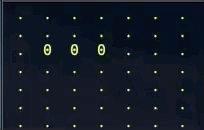
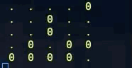
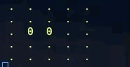
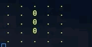

# Game of Life with Uncertainty 

Game of life is implemented with uncertainty using the header "uncertain.h" and "gaussian.h". The goal is to experiment game of life with noisy sensors. 

The implmentation here is a proof of concept in the discussed paper that bayes life enables to measure with tolerance to noise and performs as an ideal sensor to some extent. 

The following demos demonstrate the performance of the current code with gaussian noise Gaussian(mean=0,std=0.2). 

### Ideal Case 

### Naive Life 

### Sensor Life 

### Bayes Life 

## How to run it 

To run Game of Life with Bayes Life with g++, on the terminal add the following commands 

`g++ -std=c++11 -o gol_bayes gol_with_uncertainty_bayes_life.cpp`

`./gol_bayes`

